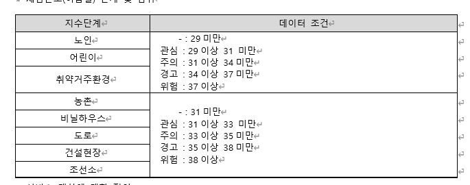

## 생활기상지수
- 지점코드가 공백일 때 전체지점조회
- 지점코드와 (시, 구, 동)이 매칭 되어있음

### 자외선 지수
- `자외선지수조회`
- 오늘, 내일, 모레, 글피 예측값을 조회하는 기능
- 11 이상 위험, 8-10 매우높음, 6-7 높음, 3-5 보통, 0-2 낮음

### 동파가능 지수
- `getFreezeIdxV2`
- 1시간 단위로 최대 78시간 후 까지의 예측값을 조회하는 기능
- 100 매우높음, 75 높음, 50 보통, 25 낮음

### 대기확상지수
- `getAirDiffusionIdxV2`
- 3시간 단위로 78시간 후 까지의 예측값을 조회하는 기능
- 100 매우높음, 75 높음, 50 보통, 25 낮음

### 체감온도
- `getSenTaIdxV2`
- 1시간 단위로 최대 78시간 후 까지의 예측값을 조회하는 기능

### 사용 시나리오
- 지점코드와 (시, 구, 동)이 매칭 되어 있어서 시, 구, 동에 대한 지점코드 DB 테이블을 생성해서 프런트에서 시, 구, 동에 대한 데이터가 오면 이거에 대해서 DB에서 찾아야 할 듯 (지점코드 pandas로 데이터 처리 후, 저장과정 필요)

- 참고  URL: https://www.data.go.kr/data/15085288/openapi.do